# Architectual design and decisions of csls-splunk-broker

## System Components

### Broker

The `broker` implements the Open Service Broker API and provides the integration between
a cloudfoundry instance and the CSLS system. It's job is to enable tenants to
turn on log shipping by issing `cf create-service` and `cf bind-service`
commands.

### Adapter

The `adapater` accepts "syslog over http" traffic, verifies that the log
messages are from a authorized source and forwards them on to the CSLS system
(AWS Kinesis). It's job is to convert cloudfoundry format logs into CSLS format logs.

## Process Overview

1. The GOV.UK PaaS tenant uses `cf create-service` to create an instance of the splunk service in their space
2. GOV.UK PaaS issues a create request to the Broker
3. There is nothing for the Broker to provision, so this is a no-op, and the Broker just return OK
4. The user gets a success response and now has a `splunk` service in their space.
5. The GOV.UK PaaS tenant uses `cf bind` to request a binding of the app they wish to ship logs from, to the service created in (1)
6. GOV.UK PaaS issues a bind request to the Broker
7. The Broker generates a unique Adapater URL only valid for the application in the binding request, and returns it to paas in the binding response
8. GOV.UK PaaS configures the application to forward logs to the syslog drain url
9. The user gets a success response and now has an app that sends it's log output to the Adapter
10. Each log line written by the application to stdout/stderr is collected by GOV.UK PaaS
11. GOV.UK PaaS converts each log line to a syslog formatted log event and sends it over HTTP to the Adapter URL previously configured in binding (6-8)
12. The Adapter verifies that the app id in log event matches the app id in the drain url by comparing a message authentication code in the URL. Attempts to send logs for a different app are rejected.
13. Transform the syslog format logs into CloudWatch format logs events
14. Push the CloudWatch format log event into the the CSLS kinesis stream queued for further processing.
15. Acknowledge successful log shipping (unsuccessful responces here will be retried a few times by GOV.UK Paas)
16. The Processor reads each CloudWatch format log event from the kinesis stream
17. The Processor uses a static file to map the log event to a splunk index based on the LogGroupName
18. The Log event is transformed from CloudWatch format to Splunk format
19. The Splunk formatted log is forwarded on to Splunk for storage and indexing

## Design Decisions

* [ADR001: Build a syslog-http to csls adapter][ADR001]
* [ADR002: Deploying the Adapter as Lambda][ADR002]
* [ADR003: Implementing a Service Broker][ADR003]
* [ADR004: Deploying the Broker as Lambda][ADR004]
* [ADR005: Authenticating log events][ADR005]
* [ADR006: Mapping log events to indexes][ADR006]

[ADR001]: ./adr/ADR001-syslog-http-to-csls-adapter.md
[ADR002]: ./adr/ADR002-deploy-adatper-as-lambda.md
[ADR003]: ./adr/ADR003-service-broker.md
[ADR004]: ./adr/ADR004-deploy-broker-as-lambda.md
[ADR005]: ./adr/ADR005-authenticating-log-events.md
[ADR006]: ./adr/ADR006-mapping-log-events-to-indexes.md
